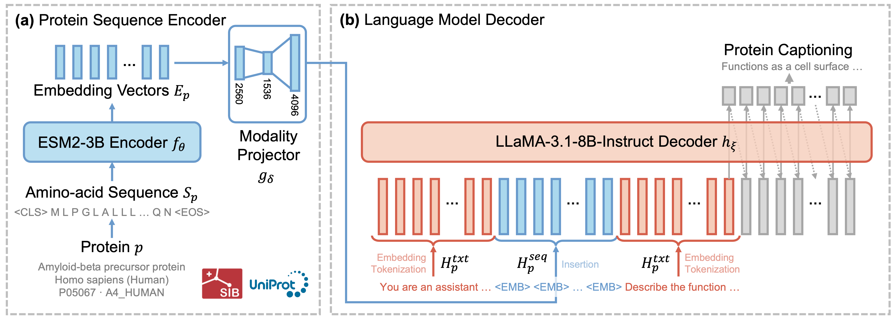
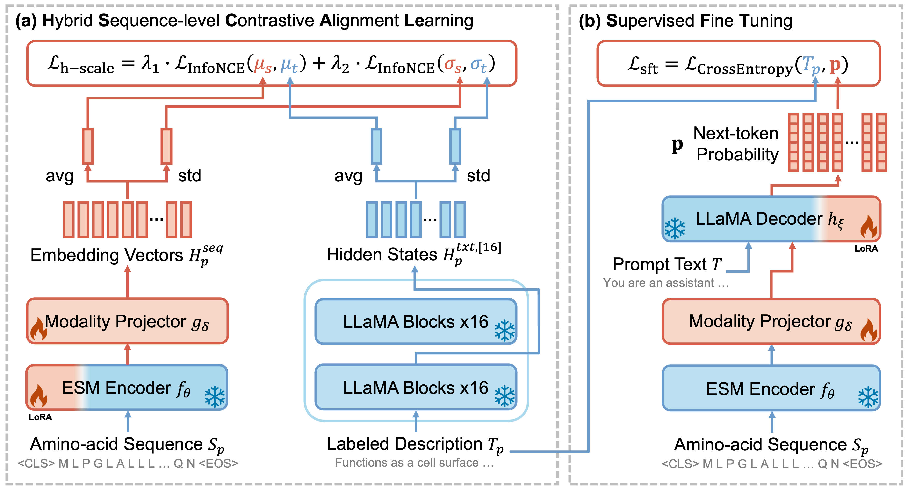

# Prot2Text-V2: Protein Function Prediction with Qwen3-14B + ESM Cambrian

Code repository for protein function prediction using multimodal contrastive alignment and instruction tuning.

## Overview





### Current Model Architecture

This repository provides **contrastive learning** and **supervised fine-tuning (SFT) with instruction tuning** for **protein function prediction** using the latest model architecture:

* **ESM C** – Advanced protein sequence encoder from EvolutionaryScale (`esmc_300m` or `esmc_600m`)
* **Modality Adapter** – Bridges protein embeddings and language model representations
* **Qwen3-14B** – Latest generation language model decoder with thinking capabilities from `Qwen/Qwen3-14B`

### Key Features

- **Simplified Setup**: CSV-only data preparation for instruction tuning
- **Modern Architecture**: Qwen3-14B with advanced reasoning capabilities
- **Parameter-Efficient**: LoRA fine-tuning for resource efficiency
- **Flexible Training**: Both contrastive learning and instruction tuning supported

## Requirements

### Environment Setup

✓ Verified on Ubuntu-22.04 with NVIDIA RTX A6000

**Important**: This setup requires `transformers>=4.51.0` for Qwen3 support.

* Install NVIDIA `cuda-toolkit=12.1.1` (see official website for details)

* Create environment and install packages:
    ```bash
    conda create -n prot2text python=3.10  # Python 3.10+ required for ESM package
    conda activate prot2text
    
    # Core PyTorch
    pip install torch torchvision torchaudio
    
    # Transformers and training (Qwen3 support)
    pip install transformers>=4.51.0 tokenizers accelerate sentencepiece
    pip install peft  # For LoRA fine-tuning
    
    # Data processing
    pip install pandas numpy
    pip install biopython  # For protein sequence validation
    pip install esm  # ESM C protein encoder (requires Python 3.10+)
    
    # Training utilities
    pip install deepspeed tensorboard evaluate tqdm
    pip install nltk rouge_score jiwer
    
    # Download utilities
    pip install huggingface-hub requests
    
    # Data processing
    pip install pandas numpy
    pip install biopython  # For protein sequence validation
    
    # Other dependencies
    pip install chardet charset-normalizer multiprocess
    ```

**Note**: The pipeline has been streamlined to use only CSV data. Previous dependencies like `torch_geometric`, `graphein`, `networkx`, and PDB processing libraries are no longer required.

**Verification**: After installation, run the verification script to ensure all packages are correctly installed:
```bash
python verify_requirements.py
```

### Data Requirements

**CSV File Format**

The CSV files must contain the following columns:
- `sequence`: Protein amino acid sequence (single letter code)
- `Full Name`: Protein name
- `taxon`: Taxonomic information  
- `function`: Protein function description

**Example CSV structure:**
```
sequence,Full Name,taxon,function
MKLLMVGS...,Adenylate cyclase,Escherichia coli,Catalyzes the formation of cAMP from ATP...
MTTLVQAV...,Beta-lactamase,Klebsiella pneumoniae,Hydrolyzes beta-lactam antibiotics...
```

**Data Download Sources**

Primary source: [HuggingFace Dataset](https://huggingface.co/datasets/habdine/Prot2Text-Data)

Required files:
- `train.csv` - Training data (required)
- `eval.csv` - Validation data (required)  
- `test.csv` - Test data (optional)

**For Instruction Tuning (Recommended - Simpler Setup)**:
- ✅ Only CSV files needed
- ✅ No PDB files required  
- ✅ Faster setup and training

**For Contrastive Learning**:
- ✅ Only CSV files needed
- ✅ No PDB files required (RGCN not used)
- ✅ Direct sequence-to-text training

## Quick Start

### 1. Data Preparation

**Option A: Automatic Download (Recommended)**

Use the provided download script to automatically get the data:

```bash
# Download data automatically
python download_data.py

# Validate the downloaded data
python validate_data.py
```

**Option B: Manual Download**

Download CSV files manually from [HuggingFace](https://huggingface.co/datasets/habdine/Prot2Text-Data):

```bash
# Create data directory
mkdir -p ./data

# Download train.csv, eval.csv (and test.csv if available)
# Place them in ./data/
```

**Data Validation**

Always validate your data before training:

```bash
# Check if CSV files have correct format
python validate_data.py
```

### 2. Simple Training (Instruction Tuning Only)

**Option A: Use the Helper Script (Recommended)**

```bash
# Quick start with sensible defaults
python run_qwen_training.py

# Debug mode with limited data
python run_qwen_training.py debug
```

**Option B: Direct Training Script**

For more control, use the training script directly:

```bash
# Train with instruction tuning
python scripts/train_instruct.py \
    --esm_model_name "esmc_600m" \
    --llama_path "Qwen/Qwen3-14B" \
    --root_csv_dir "./data" \
    --save_checkpoint_dir "./checkpoints/qwen3_instruct" \
    --batch_size_per_device 4 \
    --num_epochs 5 \
    --learning_rate 5e-5
```

### 3. Full Training Pipeline (Contrastive + Instruction)

**Training Pipeline**

Both contrastive learning and instruction tuning use only CSV files (no PDB files needed):

```bash
# Stage 1: Contrastive learning
python scripts/train_contrast.py \
    --esm_model_name "esmc_600m" \
    --llama_path "Qwen/Qwen3-14B" \
    --root_csv_dir "./data" \
    --save_checkpoint_dir "./checkpoints/qwen3_contrast" \
    --batch_size_per_device 4 \
    --num_epochs 3

# Stage 2: Instruction tuning
python scripts/train_instruct.py \
    --esm_model_name "esmc_600m" \
    --llama_path "Qwen/Qwen3-14B" \
    --root_csv_dir "./data" \
    --save_checkpoint_dir "./checkpoints/qwen3_instruct" \
    --load_adapter_checkpoint_dir "./checkpoints/qwen3_contrast" \
    --batch_size_per_device 4 \
    --num_epochs 2
```

### 4. Generate Predictions

```bash
python scripts/generate_instruct.py \
    --esm_model_name "esmc_600m" \
    --llama_path "Qwen/Qwen3-14B" \
    --root_csv_dir "./data" \
    --load_adapter_checkpoint_dir "./checkpoints/qwen3_instruct" \
    --max_generation_length 512
```

### 5. Evaluate Results

```bash
python scripts/benchmark.py \
    --evaluate_bleu \
    --evaluate_rouge \
    --evaluate_bert_score
```

## Utility Scripts

This repository includes several utility scripts to simplify the training process:

### Data Management

- **`download_data.py`**: Automatically downloads CSV files from HuggingFace
  ```bash
  python download_data.py
  ```

- **`validate_data.py`**: Validates CSV file format and reports issues
  ```bash
  python validate_data.py
  ```

- **`prepare_data.py`**: Prepares datasets for contrastive learning (CSV processing only)
  ```bash
  python prepare_data.py
  ```

### Training Helpers

- **`run_qwen_training.py`**: Simplified training script with sensible defaults
  ```bash
  python run_qwen_training.py        # Normal training
  python run_qwen_training.py debug  # Debug mode with limited data
  ```

- **`run_training.sh`**: Shell script for batch training
  ```bash
  bash run_training.sh
  ```

### Script Features

**`download_data.py`**:
- Automatically downloads train.csv, eval.csv, test.csv
- Uses HuggingFace CLI or Python library
- Provides manual download instructions if automatic fails
- Checks for existing files to avoid re-downloading

**`validate_data.py`**:
- Checks required columns: `sequence`, `Full Name`, `taxon`, `function`
- Reports missing columns and data issues
- Shows sample data for verification
- Validates protein sequences format

**`prepare_data.py`**:
- Processes CSV files for contrastive learning
- Tokenizes sequences and descriptions
- Creates preprocessed datasets for training
- No PDB files or graph processing needed

**`run_qwen_training.py`**:
- Pre-configured for Qwen3-14B with optimal settings
- Automatically sets up tokenizer with `trust_remote_code=True`
- Includes debug mode for testing
- Proper error handling and status reporting

## Advanced Configuration

### Key Training Parameters

**Contrastive Learning (`train_contrast.py`)**:
- `--esm_model_name`: ESM C model name (`esmc_300m` or `esmc_600m`)
- `--llama_path`: Qwen3 model path (`Qwen/Qwen3-14B`)
- `--root_csv_dir`: CSV files directory
- `--save_checkpoint_dir`: Checkpoint save directory
- `--contrastive_num_segments`: Number of contrastive segments
- `--batch_size_per_device`: Batch size per GPU
- `--num_epochs`: Training epochs
- `--learning_rate`: Learning rate
- `--gradient_accumulation_steps`: Steps for gradient accumulation
- `--scheduler_gamma`: Learning rate scheduler gamma
- `--torch_dtype`: Model precision (`float16` recommended)

**Instruction Tuning (`train_instruct.py`)**:
- `--load_adapter_checkpoint_dir`: Load contrastive pre-trained adapter
- `--fix_modality_adapter`: Freeze modality adapter
- `--lora_rank`: LoRA rank for parameter-efficient tuning (8-16 recommended)
- `--adapter_intermediate_dim`: Adapter dimension (1024-2048 recommended)
- `--include_text_fields`: Include protein name/taxonomy
- `--name_dropout`: Dropout rate for protein names (0.1 recommended)
- `--taxonomy_dropout`: Dropout rate for taxonomy (0.8 recommended)
- `--debug_trim_train_split`: Limit training samples for debugging
- `--debug_trim_eval_split`: Limit evaluation samples for debugging

**LoRA Target Modules** (Optimized for Qwen3-14B):
```python
target_modules = [
    "self_attn.q_proj",
    "self_attn.k_proj", 
    "self_attn.v_proj",
    "self_attn.o_proj",
    "mlp.gate_proj",
    "mlp.up_proj",
    "mlp.down_proj",
]
```

### Model Architecture Components

**Current Models**:
- **Protein Encoder**: ESM C (`esmc_300m` or `esmc_600m`) from EvolutionaryScale
- **Language Model**: `Qwen/Qwen3-14B` (with thinking capabilities)
- **Modality Adapter**: Linear projection layer
- **Parameter-Efficient**: LoRA adapters for efficient fine-tuning

**Legacy Models** (still supported):
- ESM2 + Llama models in `/models/configuration_esm2llama_*` and `/models/modeling_esm2llama_*`

### Important Notes

1. **Tokenizer Configuration**: Qwen3 requires `trust_remote_code=True` and uses `<|im_end|>` as pad token
2. **Memory Requirements**: Qwen3-14B requires significant GPU memory; adjust batch size accordingly
3. **Training Strategy**: Start with instruction tuning for quick results, add contrastive learning for better performance
4. **Data Flexibility**: CSV-only setup is sufficient for most use cases

## Troubleshooting

### Common Issues

1. **"transformers version too old"**: Update to `transformers>=4.51.0`
2. **"pad_token not found"**: Ensure tokenizer uses `pad_token='<|im_end|>'`
3. **"trust_remote_code required"**: Add `trust_remote_code=True` to tokenizer
4. **Out of memory**: Reduce `batch_size_per_device` or use gradient accumulation
5. **Model download issues**: Pre-download models with proper authentication:
   ```bash
   python -c "from transformers import AutoTokenizer, AutoModelForCausalLM; AutoTokenizer.from_pretrained('Qwen/Qwen3-14B', trust_remote_code=True); AutoModelForCausalLM.from_pretrained('Qwen/Qwen3-14B', trust_remote_code=True)"
   ```

### Debug Testing

For testing with smaller datasets:
```bash
# Test with only 10 training samples and 5 eval samples
python scripts/train_instruct.py \
    --llama_path "Qwen/Qwen3-14B" \
    --root_csv_dir "./data" \
    --save_checkpoint_dir "./test_checkpoints" \
    --torch_dtype "float16" \
    --batch_size_per_device 1 \
    --num_epochs 1 \
    --debug_trim_train_split 10 \
    --debug_trim_eval_split 5
```

### GPU Memory Optimization

For systems with limited GPU memory:
```bash
# Reduce batch size and use gradient accumulation
python scripts/train_instruct.py \
    --batch_size_per_device 1 \
    --gradient_accumulation_steps 16 \
    --lora_rank 8 \
    --adapter_intermediate_dim 1024
```

## Technical Specifications

### Qwen3-14B Model Details

**🧠 Thinking Mode Features**:
- Seamless switching between thinking and non-thinking modes
- Enhanced reasoning capabilities for complex problems
- Better performance on mathematics, coding, and logical reasoning

**🔧 Technical Specifications**:
- **Parameters**: 14.8B (13.2B non-embedding)
- **Layers**: 40
- **Attention**: 40 heads for Q, 8 for KV (GQA)
- **Context Length**: 32,768 tokens (131,072 with YaRN)
- **Architecture**: Transformer with RoPE, SwiGLU, RMSNorm

**💡 Improvements Over Qwen2.5**:
- Superior reasoning capabilities
- Better instruction following
- Enhanced agent capabilities
- Improved multilingual support (100+ languages)
- More natural conversational experience

### ESM Cambrian (ESM++) Details

**Protein Encoder**: `esmc_300m` or `esmc_600m` from EvolutionaryScale
- Advanced protein sequence understanding
- Pre-trained on large-scale protein datasets
- Optimized for protein function prediction tasks

### Training Architecture

**Current Pipeline**:
1. **ESM Cambrian** encodes protein sequences
2. **Modality Adapter** bridges protein embeddings to text embeddings  
3. **Qwen3-14B** generates protein function descriptions with thinking capabilities
4. **LoRA** fine-tunes efficiently without full model training

**Key Design Decisions**:
- **No RGCN/Graph Processing**: Direct sequence-to-text mapping for simplicity
- **CSV-Only Data**: No PDB files required for any training mode
- **Parameter-Efficient**: LoRA fine-tuning reduces training costs
- **Flexible Architecture**: Supports both contrastive and instruction learning

### Data Pipeline Comparison

**Previous Version (with RGCN)**:
```
CSV → PDB Download → Graph Processing → Tokenization → Training
```

**Current Version (Simplified)**:
```
CSV → Tokenization → Training
```

**Benefits of Simplified Pipeline**:
1. **Faster Setup**: No need for complex graph dependencies
2. **Faster Training**: Direct sequence-to-text processing
3. **Reduced Data Requirements**: Only CSV files needed
4. **Better Compatibility**: Fewer dependency conflicts
5. **Easier Debugging**: Simpler data pipeline

## Summary

This repository provides a **simplified and modernized** approach to protein function prediction:

### Key Advantages

1. **Modern Architecture**: Uses the latest Qwen3-14B model with thinking capabilities
2. **Simplified Setup**: CSV-only data pipeline eliminates complex graph processing
3. **Parameter-Efficient**: LoRA fine-tuning reduces computational requirements
4. **Flexible Training**: Supports both contrastive learning and instruction tuning
5. **Easy Debugging**: Built-in debug modes for testing with limited data

### Quick Start Workflow

```bash
# 1. Install dependencies
pip install torch transformers>=4.51.0 peft pandas numpy biopython esm

# 2. Download data
python download_data.py

# 3. Validate data
python validate_data.py

# 4. Start training
python run_qwen_training.py

# 5. Generate predictions
python scripts/generate_instruct.py --load_adapter_checkpoint_dir "./checkpoints/qwen3_instruct"
```

### Data Requirements Summary

- **Input**: CSV files with `sequence`, `Full Name`, `taxon`, `function` columns
- **No PDB files required**: Simplified data pipeline
- **No graph processing**: Direct sequence-to-text mapping
- **Storage**: ~100MB for CSV files, ~10-50GB for model checkpoints

The setup is significantly simpler than previous versions while maintaining full functionality for protein function prediction.

## Citation

If you use this code in your research, please cite:

```bibtex
@article{prot2text_v2,
  title={Prot2Text-V2: Protein Function Prediction with Multimodal Contrastive Alignment},
  author={[Authors]},
  journal={[Journal]},
  year={2024}
}
```

### Package Requirements Validation

**Core Dependencies** (Essential):
- `torch` - Core PyTorch framework
- `transformers>=4.51.0` - Required for Qwen3-14B support
- `tokenizers` - Required by transformers
- `accelerate` - Used for distributed training
- `peft` - Used for LoRA fine-tuning
- `pandas` - Used in CSV data loading
- `numpy` - Used throughout for array operations
- `tqdm` - Used for progress bars in training scripts
- `esm` - Official ESM package for protein encoder (requires Python 3.10+)

**Training Dependencies** (Essential):
- `deepspeed` - Used for distributed training
- `tensorboard` - Used for training monitoring
- `evaluate` - Used in benchmark script
- `nltk` - Used for text evaluation metrics
- `rouge_score` - Used for ROUGE metrics
- `jiwer` - Used for WER metrics

**Data Processing Dependencies** (Essential):
- `biopython` - Used for protein sequence validation
- `huggingface-hub` - Used in download_data.py
- `requests` - Used for HTTP requests in data download

**Utility Dependencies** (Essential):
- `chardet` - Used for character encoding detection
- `charset-normalizer` - Used for text normalization
- `multiprocess` - Used for parallel processing
- `sentencepiece` - Required by some tokenizers

**Removed Dependencies** (No longer needed for CSV-only workflow):
- `torch_geometric` - Only used in RGCN models (not used in current workflow)
- `networkx` - Only used for graph processing (not used in current workflow)
- `graphein` - Only used for PDB graph construction (not used in current workflow)
- `biopandas` - Only used for PDB file processing (not used in current workflow)

### Storage Requirements

- **CSV files**: ~10-100MB each
- **Model checkpoints**: ~10-50GB
- **Processed data**: ~1-5GB
- **No PDB files required**: Significantly reduced storage needs

### Migration from Previous Versions

**No Breaking Changes**:
- LoRA target modules remain the same (compatible with Qwen3)
- Data format unchanged (same CSV structure)
- Training arguments unchanged
- Model architecture unchanged (ESM Cambrian + Adapter + LLM)

**Backward Compatibility**:
- Existing checkpoints should work (adapter layers remain compatible)
- Same training pipeline and data preprocessing
- No changes to ESM Cambrian encoder

**Important Changes**:
- **Model**: Updated from Llama 3.1 to Qwen3-14B
- **Tokenizer**: Changed from `<|reserved_special_token_0|>` to `<|im_end|>`
- **Requirements**: Added `trust_remote_code=True` for Qwen3
- **Dependencies**: Removed graph processing libraries (torch_geometric, networkx, graphein)
